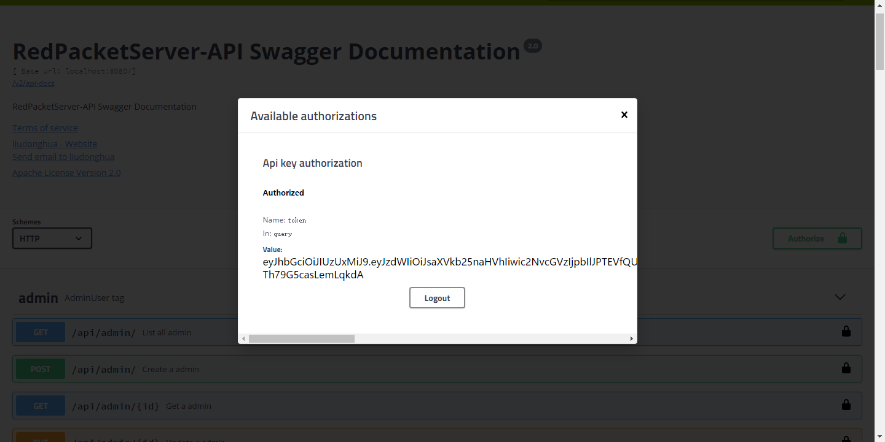

# redpacket_server

This is a sample test app wrote with spring-boot technology, swagger2 and some other cool stuff.

### Prerequisite

1. Install maven
2. Install MySql and create a database redpacket using `create database redpacket DEFAULT CHARACTER SET utf8 COLLATE utf8_general_ci;`

### How to run it

1. git clone https://github.com/liudonghua123/redpacket_server.git
2. cd redpacket_server
3. Configure your database connection settings in `src/main/resources/applicaiton.yml`, it's self explanatory.
3. Run `mvn spring-boot:run` or import the project into an IDE（eclipse、idea） then run `Application.java` as Java application.
4. navagation `http://localhost:8080/swagger-ui-standalone.html#/`

### How to invoke the provided api

1. You need to invoke /api/auth/login, fill the correct username and password to get token
  
  
2. Copy the token and fill into the Authorization area
  
3. Now you can see the active lock on the right side
  
4. Go to explore the api